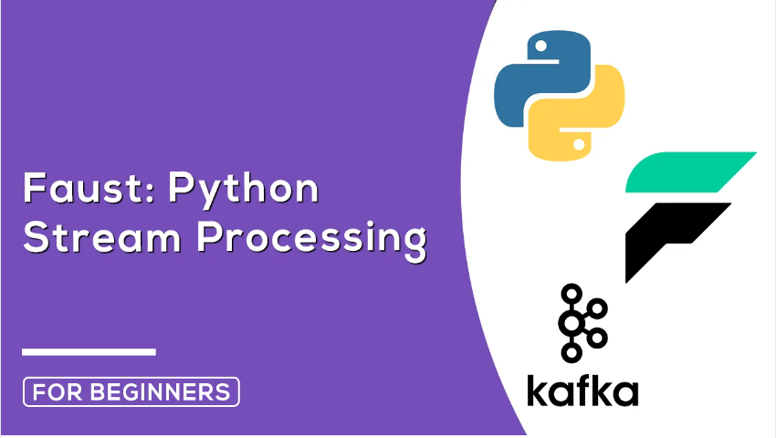
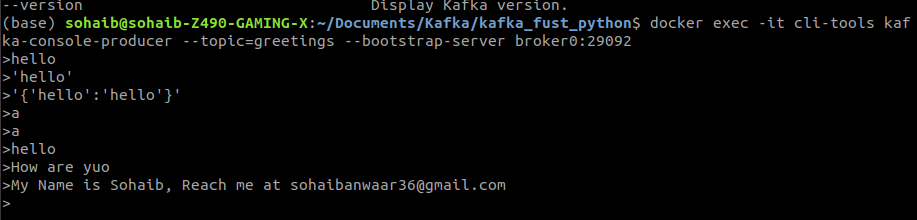
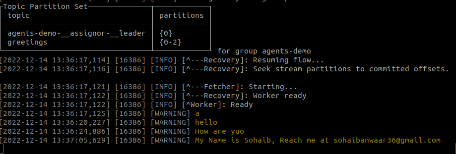

# Kafka Streaming with Faust

## Introduction

This is a simple example of how to use Faust to stream data from Kafka. The data is a simple JSON object with a timestamp and a random number. The data is generated by a Python script and sent to Kafka. Faust is used to read the data from Kafka.

## Prerequisites

- Python 3.6+
- Docker
- Docker Compose

## Setup

1. Clone the repository
2. Run `docker-compose up -d` to start the Kafka cluster
3. Run `pip install -r requirements.txt` to install the Python dependencies
4. Run `python main.py` to start the producer
5. Run `faust -A faust_stream worker -l info` to start the Faust worker

## Usage

The producer will generate a random number every second and send it to Kafka. The Faust worker will read the data from Kafka and print it to the console.

## Faust Kafka Consumer in Python

Making a Kafka consumer with the help of Faust module. 

```python
import faust

app= faust.App('agents-demo')

greetings_topic = app.topic('greetings', value_type=str, value_serializer='raw')

@app.agent(greetings_topic)
async def greet(stream):
    async for greeting in stream:
        print(greeting)

if __name__ == '__main__':
    app.main()
    
```

### Start the Faust Worker

Now after completing the code, we will start the Faust worker.
```bash
faust -A faust_stream worker -l info
```

## Test Consumer
Now we will test the consumer by sending some data to the topic through docker cli

```python
docker exec -it cli-tools kafka-console-producer --topic=greetings --bootstrap-server broker0:29092
```

## Output

**Producer Screenshot**


**Consumer Screenshot**


## Faust Kafka Producer in Python
Now lets make a producer with the help of faust module.

```python
# Producer
@app.timer(interval=1.0)
async def send_greeting():
    await greetings_topic.send(value='Hello, World!')
    
```
Start the file again with the help of the following command
```bash
faust -A faust_stream worker -l info
```
Now you will see the hello world message in the consumer every second.

## Check out the code on GitHub:

https://github.com/SohaibAnwaar/Kafka-Faust-Python

# Author

- Sohaib Anwaar : https://www.sohaibanwaar.com
- gmail : sohaibanwaar36@gmail.com
- linkedin : [Have Some Professional Talk here](https://www.linkedin.com/in/sohaib-anwaar-4b7ba1187/)
- Stack Overflow : [Get my help Here](https://stackoverflow.com/users/7959545/sohaib-anwaar)
- Kaggle : [View my master-pieces here](https://www.kaggle.com/sohaibanwaar1203)
- Github : [View my code here](https://github.com/SohaibAnwaar)
